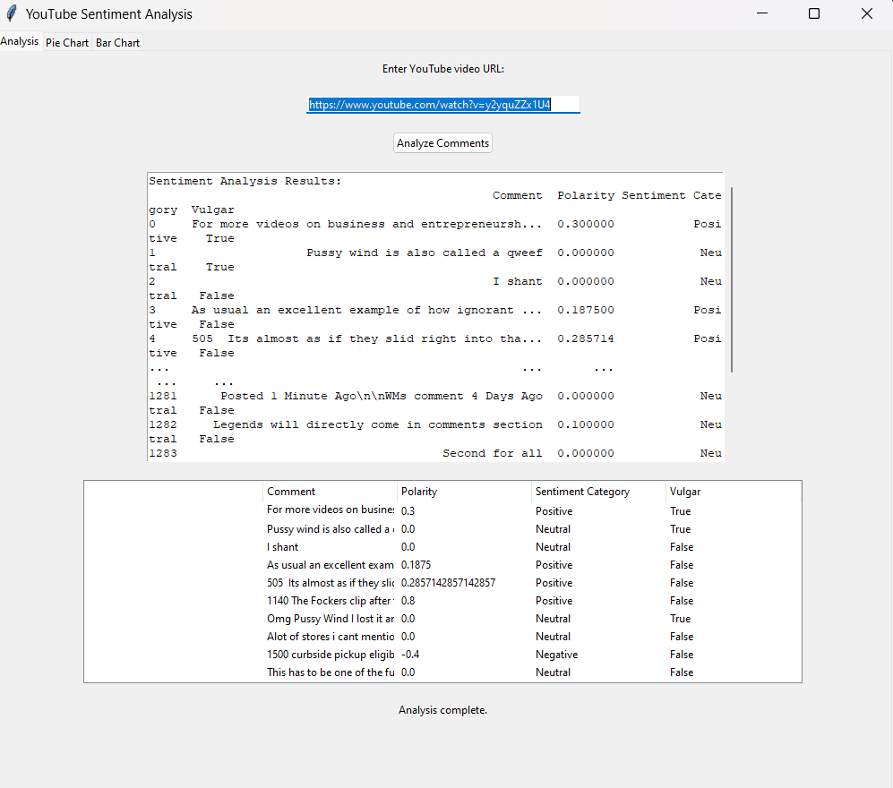
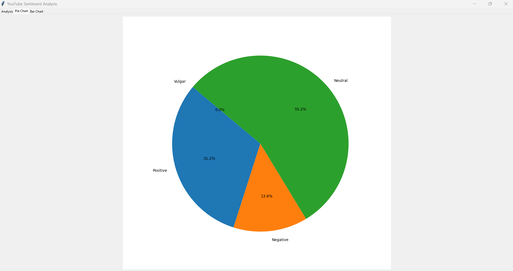
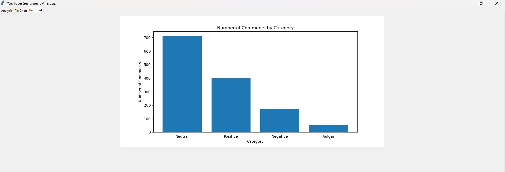

# YouTube Sentiment Analysis

This project is a GUI application built with Python's `tkinter` that performs sentiment analysis on comments from a specified YouTube video. The application retrieves comments using the YouTube Data API, cleans the comments, analyzes their sentiment, checks for profanity, and visualizes the results with pie and bar charts.

## Features

- Retrieve comments from a YouTube video using the YouTube Data API.
- Clean comments by removing emojis and non-alphanumeric characters.
- Analyze the sentiment of comments using the `TextBlob` library.
- Check comments for profanity using a predefined list of vulgar words.
- Display results in a table within the GUI.
- Visualize sentiment analysis results using pie and bar charts.

## Prerequisites

- Python 3.x
- `tkinter` library (included with standard Python installation)
- `pandas` library
- `textblob` library
- `google-api-python-client` library
- `matplotlib` library

## Installation

1. Clone the repository:
    ```sh
    git clone https://github.com/rushigiri11/YouTube-Comments-Sentiment-Analysis.git
    cd YouTube-Sentiment-Analysis
    ```

2. Install the required libraries:
    ```sh
    pip install pandas textblob google-api-python-client matplotlib
    ```

3. Obtain a YouTube Data API key from the Google Developers Console and replace the placeholder API key in the code:
    ```python
    api_key = "YOUR_YOUTUBE_API_KEY"
    ```

4. Ensure you have a list of profanity words in a text file (one word per line). Update the file path in the code if necessary:
    ```python
    with open(r"path_to_your_profanity_words.txt", "r") as file:
        profanity_words = [word.strip() for word in file.readlines()]
    ```

## Usage

1. Run the `main.py` script to start the application:
    ```sh
    python main.py
    ```

2. Enter the URL of a YouTube video into the provided entry field.

3. Click the "Analyze Comments" button to start the sentiment analysis.

4. The application will display the results in a table, including each comment's polarity, sentiment category, and whether it contains profanity.

5. The pie chart tab will display a pie chart showing the distribution of sentiment categories and vulgar comments.

6. The bar chart tab will display a bar chart showing the number of comments in each sentiment category and the number of vulgar comments.

## Code Explanation

### Main Application Class

#### `SentimentAnalysisApp`

- `__init__(self, master)`: Initializes the main application window, sets up the GUI components (tabs, labels, entry fields, buttons, etc.), and configures the layout.
- `update_progress(self, message)`: Updates the progress label with a given message.
- `update_table(self, output_table)`: Updates the result table with the sentiment analysis results.
- `create_pie_chart(self, output_table)`: Creates and displays a pie chart based on the sentiment analysis results.
- `create_bar_chart(self, output_table)`: Creates and displays a bar chart based on the sentiment analysis results.
- `analyze_comments(self)`: Retrieves the YouTube video URL entered by the user and starts the analysis in a separate thread.
- `run_analysis(self, video_url)`: Performs the sentiment analysis, updates the result table, and creates the visualizations.
- `enable_analyze_button(self)`: Enables the "Analyze Comments" button after the analysis is complete.

### Helper Functions

- `get_video_comments(api_key, video_url)`: Retrieves comments from a YouTube video using the YouTube Data API.
- `clean_comment(comment)`: Cleans a comment by removing emojis and non-alphanumeric characters.
- `analyze_comments(comments)`: Analyzes the sentiment of comments, categorizes them, and checks for profanity.
- `is_profane(comment)`: Checks if a comment contains any words from the profanity list.


## Screenshots

### Application Interface


### Pie Chart


### Bar Chart


## Contributing

Contributions are welcome! Please open an issue or submit a pull request for any improvements or bug fixes.

## License

This project is licensed under the MIT License. See the `LICENSE` file for details.


